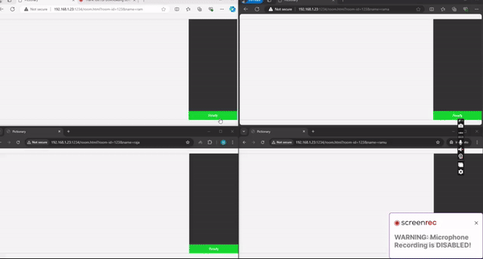

# Drawing Game

## Overview

This is a real-time drawing and guessing game built using Node.js and Socket.io. The game allows users to join a room, where one user acts as the "drawer" and the others as "guessers." The drawer attempts to draw a word while the guessers try to guess what it is. The game is designed to be fun and interactive, making use of real-time web technologies.

## Features

- **Real-time Drawing**: Users can draw on a canvas, and their drawings are synchronized across all clients in the room.
- **Guessing Mechanism**: Guessers can submit their guesses, and the game will notify them if they are correct.
- **Room Management**: Users can join specific rooms, and the game will manage multiple rooms simultaneously.
- **Responsive Design**: The game is designed to work on various screen sizes.

## Technologies Used

- **Node.js**: For the server-side logic.
- **Socket.io**: For real-time communication between the server and clients.
- **HTML/CSS**: For the front-end user interface.
- **JavaScript**: For client-side interactivity.

## Getting Started

### Prerequisites

- Node.js installed on your machine.
- A modern web browser.

### Installation
1. Clone the repository:
   ```bash
   git clone https://github.com/yourusername/drawing-game.git
   cd drawing-game
   ```

2. Install the dependencies for both client and server:
   ```bash
   cd client && npm install && cd ..
   cd server && npm install && cd ..
   ```

3. Start the server and client separately:
   ```bash
   cd server && node server.js &
   cd client && npm start &
   ```

4. Update the IP in `client/room.js` to point to your server IP.
5. Open your browser and navigate to `http://localhost:3000`.

### How to Play

1. Enter your name and room ID to join a game.
2. Once all players are ready, the game will randomly assign one player as the drawer.
3. The drawer will see a word to draw, while the guessers will try to guess the word based on the drawing.
4. The game continues until a guesser correctly identifies the word.

## Demo

Here is a demonstration of the game:
<!-- Paste your GIF link here -->
{ width="100vw" height="100vh }

## Contributing

Contributions are welcome! If you have suggestions for improvements or new features, feel free to open an issue or submit a pull request.

## License

This project is licensed under the MIT License - see the [LICENSE](LICENSE) file for details.

## Acknowledgments

- Thanks to the contributors and the open-source community for their support and resources.
